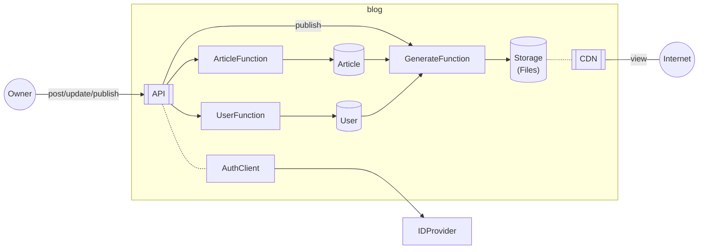

# blog

```mermaid
graph LR
  subgraph blog
    Article[(Article)]
    User[(User)]
    Storage[("Storage\n(Files)")]
    API[[API]]
    ArticleFunction
    UserFunction
    AuthClient
    GenerateFunction
    CDN[[CDN]]
  end

  Owner((Owner))
  Internet((Internet))

  Owner -- "post/update/publish" --> API
  ArticleFunction --> Article
  UserFunction --> User
  API --> ArticleFunction
  API --> UserFunction
  API -.- AuthClient
  AuthClient ---> IDProvider
  API -- publish --> GenerateFunction
  Article --> GenerateFunction
  User --> GenerateFunction
  GenerateFunction --> Storage
  Storage -.- CDN
  CDN -- view--- Internet
```
