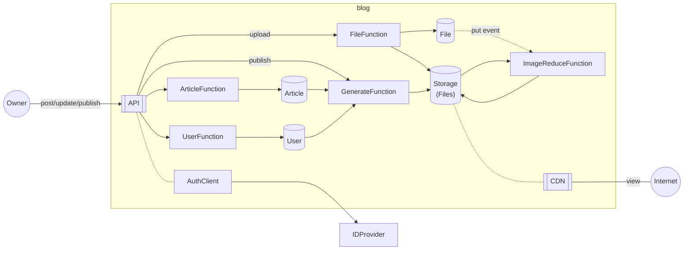

# blog

## Diagram

## Table: User
### Schema
|AttrName|Type|Key  |
|--------|----|-----|
|Id      |S   |Hash |
|Attr    |S   |Range|
|Name    |S   |     |
### Attributes
* **Id**: User ID
* **Attr**: Always `Main`
* **Name**: Unique user name to be used in URL path
### Index: NameIndex
|AttrName|Key  |
|--------|-----|
|Name    |Hash |
## Table: Article
TODO
## Table: File
### Schema
|AttrName|Type|Key  |
|--------|----|-----|
|Key     |S   |Hash |
|Attr    |S   |Range|
|UserId  |S   |     |
|CType   |S   |     |
|TS      |N   |     |
|Size    |N   |     |
|W       |N   |     |
|H       |N   |     |
|Ext     |S   |     |
|UserIdx |S   |     |
### Attributes
* **Key**: S3 object key. Not reused. randomized string.
* **Attr**: Attributes of this object
  * **Orig**: Original file
  * **Rep:{W}x{H}**: Reduced replica
* **UserId**: User ID by IDP
* **UserIdx**: Same as `UserId` when `Attr` is `Orig`. Otherwise, empty.
* **CType**: Content Type
* **TS**: Created at
* **Size**: Image size(bytes)
* **W**,**H**: Widht and height
* **Ext**: Extension
### Index: UserIndex
|AttrName|Key  |
|--------|-----|
|UserIdx |Hash |
|TS      |Range|

## URL path design
* **/{User:Id}**: Index
* **/{User:Id}/{Article:Id}**: Article
* **/files/{File:Key}/{File:Attr}.{File:Ext}**
